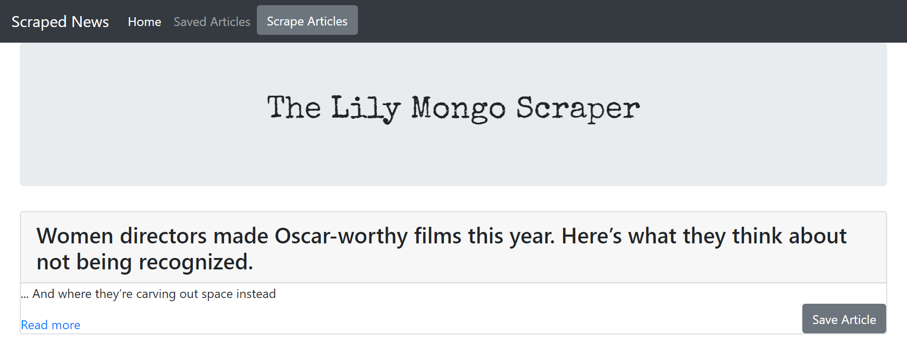

# scrapedNews

 The Lily Mongo Scraper: https://frozen-crag-47443.herokuapp.com/

scrapedNews is a Web Scraping Application that uses Axios and Cheerio to scrape article headlines,summaries, and their original links. Users save their favorite articles and add a note about the newsarticle.

Technologies used:

* Express-Handlebars for Templating
* Javascript and jQuery for front-end logic, ajax calls,    and accessing page elements
* NodeJS and ExpressJS for setting up the server and        routing
* Axios and Cheerio to Scrape Newspaper 
* MongoDB/Mongoose to store articles and notes
* Bootstrap for Styling

